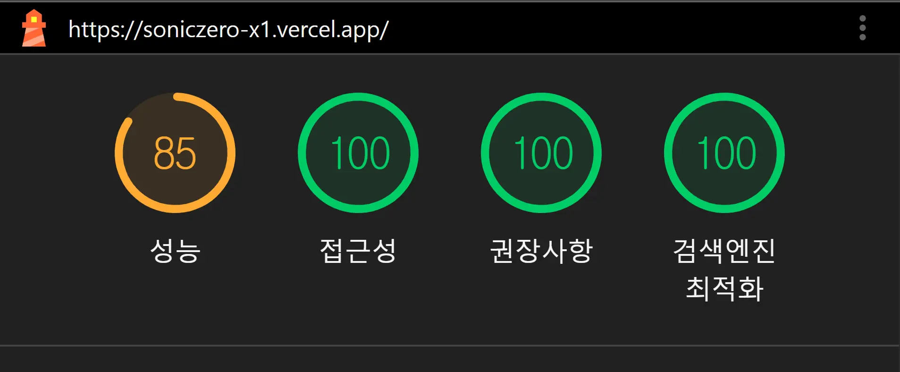

# 🎧 SonicZero X1 - Premium Wireless Headphones
> 완벽한 침묵 속에서 깨어나는 압도적인 사운드. 가상의 프리미엄 오디오 브랜드 'SonicZero'의 플래그십 무선 헤드폰 제품 소개 및 쇼핑몰 랜딩 페이지입니다.

🔗 **[웹사이트 바로가기 (Live Demo)](https://soniczero-x1.vercel.app/)**

---

## 👨‍💻 프로젝트 소개
2년 차 프론트엔드 퍼블리셔로서의 HTML/CSS 마크업 전문성과 React 기반의 컴포넌트 설계, 그리고 동적인 UI/UX 구현 역량을 종합적으로 보여주기 위해 제작된 포트폴리오 프로젝트입니다. 

기획부터 디자인 시스템 설계, 퍼블리싱, 애니메이션 연출, 배포까지 전 과정을 주도적으로 수행했습니다.

### 프로젝트 범위
| 구분 | 내용 |
|---|---|
| **페이지** | 홈, 기술 소개, 스펙, 고객 지원, 쇼핑 (총 5페이지) |
| **반응형** | PC(1440px 이상) · Laptop(1280px) · Tablet(1024px) · Mobile-lg(768px) · Mobile-sm(480px) 환경을 아우르는 5단 반응형 레이아웃 |
| **기능** | 스크롤 애니메이션, 커스텀 셀렉트, 탭·아코디언 인터랙션, 코드 스플리팅 |
| **기간** | 약 60시간 (1인 작업) |

---

##  핵심 구현 사항 (Key Highlights)

### 1. 확장성과 협업을 극대화한 토큰(Token) 기반 디자인 시스템 구축
*   **중앙 집중형 스타일 딕셔너리:** 컬러, 4px/8px 배수 기반의 Spacing, Radius 등의 디자인 원소를 `_variables.scss`에 CSS 변수로 토큰화하여 전역 관리함으로써 전체적인 UI 일관성을 확보했습니다.
*   **Sass Map & Mixin 고도화:** 복잡한 타이포그래피 세트를 Sass의 `Map` 객체로 추상화하고, `@mixin text-style`로 한 번에 호출하는 모듈형 아키텍처를 설계하여 압도적인 유지보수성을 구현했습니다. (👉 [코드 보기](https://github.com/Jongju-Lee/soniczero-x1/blob/main/src/styles/abstracts/_variables.scss))

### 2. 웹 접근성(KWCAG 2.2) 지침을 고려한 UI 마크업
*   **시맨틱 마크업과 스크린 리더기 대응:** 스크린 리더 사용자를 고려하여 시맨틱 태그로 문서 구조를 짰습니다. 모든 이미지 태그에 요소의 의미를 담아 `alt` 속성을 부여하고, 화면 디자인을 위한 단순 장식용 요소들은 `aria-hidden` 처리하여 정보의 혼선을 방지했습니다.

### 3. 다양한 디바이스 환경을 고려한 반응형(Responsive) 웹 최적화
*   **Clamp 기반 반응형 폰트 시스템:** CSS `clamp()` 함수를 통해 화면 크기에 비례하여 자연스럽게 조절되는 가변 폰트 시스템을 적용했습니다.
*   **모바일 브라우저 이슈 대응:** 아이폰 Safari 등의 모바일 브라우저에서 하단 탭바에 UI가 가려지는 문제를 막기 위해 `100dvh` 단위와 `env(safe-area-inset-bottom)` 속성을 사용하여 레이아웃을 설계했습니다.

### 4. 인터랙티브 UX를 위한 시각적 제어 (GSAP)
*   **Scroll 애니메이션 연출:** 몰입감 높은 스크롤 애니메이션을 구현하되, 렌더링 부하를 줄이고 재사용성을 높이기 위해 로직을 `useScrollFadeIn` 커스텀 훅(Hook)으로 분리했습니다.

### 5. 사용자 경험(UX) 및 접근성을 고려한 커스텀 토스트 알림 (Toast Notification)
*   **성능 최적화 및 CSS 가속 연동:** 여러 알림이 겹쳐지는(Stacking) 동작을 구현할 때, 복잡한 JS 연산을 배제하고 순수 CSS 변수(`--toast-depth`)와 `transform`, `opacity` 속성에 렌더링 제어권을 위임하여 성능 부하를 줄였습니다.
*   **웹 접근성 강화:** 3개가 넘어가는 오래된 알림은 스크린 리더가 읽지 않도록 동적 `aria-hidden` 처리를 덧붙였으며, `prefers-reduced-motion` 미디어 쿼리를 사용해 OS 설정에 따른 애니메이션 대체안도 구현했습니다.

---

##  Lighthouse 성능 지표

<p align="center">
  
</p>

> 접근성 · 권장사항 · 검색엔진 최적화 100점 달성. 성능 부분의 85점은 GSAP ScrollTrigger의 강제 리플로우 및 Variable Font 로딩 지연이 주요 원인으로, 개발자 통제 가능 영역은 지속 개선 중입니다.

---

## 🛠 운영 및 기술 스택 (Tech Stack)

### Core


### Styling & Animation


### Deployment & Tooling


---

## ⚙️ 로컬 실행 방법 (How to run locally)

```bash
# 1. 패키지 설치
npm install

# 2. 로컬 개발 서버 실행
npm run dev

# 3. 빌드 테스트
npm run build
npm run preview
```

---

## 📐 페이지 구성

### 홈 (`/`)
| 섹션 | 설명 |
|---|---|
| Main | 풀스크린 히어로 + 제품 헤드라인 |
| Story | 브랜드 스토리 + 스크롤 페이드인 애니메이션 |
| CTA | 구매 유도 + 행동 유도 버튼 |

### 기술 소개 (`/technology`)
| 섹션 | 설명 |
|---|---|
| TechAnc | ANC(능동 소음 제거) 기술 상세 소개 |
| TechFeatures | 핵심 기능 목록 + 아이콘 카드 |

### 스펙 (`/specs`)
| 섹션 | 설명 |
|---|---|
| SpecsChart | 주파수 응답·드라이버 성능 시각화 차트 |
| SpecsTable | 전체 기술 사양 비교표 |

### 고객 지원 (`/support`)
| 섹션 | 설명 |
|---|---|
| SupportSearch | 키워드 검색 |
| SupportFaq | 자주 묻는 질문 아코디언 |
| SupportDownloads | 메뉴얼·드라이버 다운로드 목록 |
| SupportContact | 문의 채널 안내 |

### 쇼핑 (`/shop`)
| 섹션 | 설명 |
|---|---|
| ShopDetails | 색상·옵션 선택 + 가격 정보 |
| ShopGallery | 제품 갤러리 이미지 슬라이더 |

---

## 🗂 프로젝트 구조
```
src/
├── pages/          # 라우트 단위 페이지 컴포넌트 (코드 스플리팅 적용)
├── sections/       # 페이지별 섹션 컴포넌트 (home / technology / specs / support / shop)
├── components/     # 공통 UI 컴포넌트 (Button, CustomSelect, Toast 등)
├── layouts/        # 전체 레이아웃 (Header, Footer, RootLayout)
├── hooks/          # 재사용 커스텀 훅 (스크롤 애니메이션, 포커스 트랩 등)
└── styles/         # SCSS 아키텍처 (abstracts / base / components / layout / sections)
```
